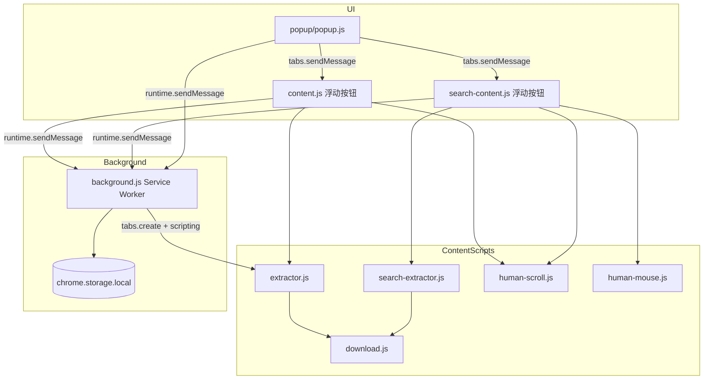

# JD Product Extractor — 开发者文档

面向维护者与二次开发者的技术说明。普通使用说明见 [用户指南](./用户指南.md)。

**当前版本**：1.1.0（`manifest.json`）

---

## 目录

- [项目概述](#项目概述)
- [架构](#架构)
- [目录结构](#目录结构)
- [运行与调试](#运行与调试)
- [核心模块](#核心模块)
- [消息协议](#消息协议)
- [本地存储](#本地存储)
- [数据模型 ProductSource](#数据模型-productsource)
- [页面适配要点](#页面适配要点)
- [扩展与修改指南](#扩展与修改指南)
- [离线测试](#离线测试)
- [权限清单](#权限清单)

---

## 项目概述

Chrome Extension **Manifest V3**，在京东商品详情页与搜索/列表页注入 content scripts，解析 DOM 与页面内 `pageConfig`、评价 API 等，输出与 **product-validator** 中 `ProductSource` / `Variant` 规则对齐的 JSON 对象，以 **JSONL**（NDJSON）形式缓存或下载。

设计要点：

- **无构建步骤**：源码即扩展，直接「加载已解压的扩展程序」。
- **人类行为模拟**：`human-scroll.js`（贝塞尔滚屏）、`human-mouse.js`（轨迹点击）降低懒加载漏字段。
- **双通道 UI**：`popup/` 与页面浮动面板均可触发同一套提取逻辑。
- **批量详情**：`background.js` 通过 `chrome.tabs` 新开标签提取后关闭，搜索页 content script 负责深度抓取编排。

---

## 架构



### 页面类型与脚本加载

| URL 模式 | 自动注入（manifest content_scripts） | 弹窗可额外注入 |
|----------|--------------------------------------|----------------|
| `search.jd.com`, `list.jd.com` | human-scroll, human-mouse, search-extractor, download, search-content | 同上（`injectSearchScripts`） |
| `item.*.com/*.html` | human-scroll, extractor, download, content | 同上（`injectItemScripts`） |

`popup.js` 在 `sendMessage` 失败时会调用 `chrome.scripting.executeScript` 补注入，避免用户过早打开弹窗导致 listener 未注册。

---

## 目录结构

```
jd-product-extractor/
├── manifest.json           # MV3 清单、权限、content_scripts 匹配
├── background.js           # 存储、去重、EXTRACT_URL_IN_NEW_TAB
├── popup/
│   ├── popup.html          # 弹窗结构
│   ├── popup.js            # 模式切换、超时、消息编排
│   └── popup.css
├── src/
│   ├── extractor.js        # JdProductExtractor — 详情页 → ProductSource
│   ├── search-extractor.js # JdSearchExtractor — 搜索列表/翻页/URL 收集
│   ├── content.js          # 详情页 UI + EXTRACT_JD_PRODUCT*
│   ├── search-content.js   # 搜索页 UI + 深度抓取/批量详情
│   ├── human-scroll.js     # JdHumanScroll.scrollPageToBottom
│   ├── human-mouse.js      # JdHumanMouse.humanClick / humanClickOpenInNewTab
│   └── download.js         # JdJsonlDownload.downloadRecords
├── scripts/
│   ├── test_saved_page.mjs # Node + linkedom 测详情解析
│   └── test_search_page.mjs
├── icons/
└── docs/
    ├── 用户指南.md
    └── 开发者文档.md
```

---

## 运行与调试

### 加载扩展

1. `chrome://extensions` → 开发者模式 → 加载已解压 → 选仓库根目录。
2. 修改任意 JS 后点击扩展 **重新加载**，并 **刷新** 目标京东标签页。

### 调试入口

| 组件 | 打开方式 |
|------|----------|
| Service Worker | 扩展卡片 → 「Service Worker」链接 → DevTools |
| Content script | 京东页面 F12 → Sources → Content scripts |
| Popup | 右键扩展图标 → 检查弹出内容 |

### 常用断点位置

- `extractor.js` → `extractJdProduct` / `resolveProduct`
- `search-extractor.js` → `findSearchCards` / `parseSearchCard`
- `background.js` → `extractProductInNewTab`
- `search-content.js` → `runDeepCrawlSearch` / `runBatchDetailExtract`

---

## 核心模块

### `extractor.js` — `JdProductExtractor`

导出（IIFE 挂到 `global.JdProductExtractor`）：

| API | 说明 |
|-----|------|
| `extractJdProduct(options?)` | 异步主入口，返回带 `_validation_errors` 的 payload |
| `validateProductSourceShape(data)` | 客户端校验，返回 `string[]` |
| `tryBuildProductFromDom()` | 无 `pageConfig` 时从 DOM 拼装 product 对象（新详情页） |
| `isNewJdItemPage()` | 判断是否新版 React 详情布局 |

数据获取优先级概要：

1. 全局 `pageConfig.product`（经典页）
2. `tryBuildProductFromDom()`（`#root`、`.sku-title` 等）
3. `waitFor` 轮询直至超时

并行拉取：`resolveDescription`、`resolvePrice`、`fetchCommentSummary(skuId)`（`club.jd.com` / `api.m.jd.com`）。

图片：`dedupeAndPreferLargeImages` + `upgradeJdImageUrl`（优先 s1440 / n1）。

### `search-extractor.js` — `JdSearchExtractor`

| API | 说明 |
|-----|------|
| `extractJdSearchProducts(opts)` | 当前页列表 → `products[]` |
| `extractJdSearchProductsMultiPage({ maxPages })` | 滚屏 + 点击下一页 + 去重合并 |
| `collectUrlsFromSearchPage` / `collectSearchUrlsMultiPage` | 仅收集 `{ url, sku, title, search_keyword, ... }` |
| `findSearchCards()` | 多 selector 回退，要求 `data-sku` 且 6 位以上数字 |
| `humanScrollPage` | 委托 `JdHumanScroll` |
| `clickNextPage` / `waitForNewSearchResults` | 翻页与结果刷新检测 |

列表卡片 selector 优先级（节选）：

```javascript
"[data-sku].plugin_goodsCardWrapper",
"li.gl-item[data-sku]",
"#J_goodsList li[data-sku]",
// ...
```

### `human-scroll.js` — `JdHumanScroll`

`scrollPageToBottom({ maxRounds, pauseMinMs, pauseMaxMs, ... })`：分段贝塞尔滚动至 `document.body` 底部，用于触发懒加载。

### `human-mouse.js` — `JdHumanMouse`

- `humanClick(element, { move })` — 移动指针后点击
- `humanClickOpenInNewTab(link)` — 模拟中键/Ctrl+点击打开新标签（深度抓取用）

### `download.js` — `JdJsonlDownload`

```javascript
JdJsonlDownload.downloadRecords(records, filename?)
// recordsToJsonl: records.map(JSON.stringify).join("\n") + "\n"
```

通过临时 `<a download>` + `Blob` 触发下载（popup 与 content 均可调用）。

### `content.js`（详情页）

- 注入浮动面板：`只提取` / `提取并下载`
- 监听消息：`EXTRACT_JD_PRODUCT`、`EXTRACT_JD_PRODUCT_WITH_SCROLL`（异步 `return true`）

`handleExtractMessage` 选项：

| option | 默认 | 含义 |
|--------|------|------|
| `scroll` | true | 提取前滚屏 |
| `save` | true | `APPEND_JSONL_RECORD` |
| `download` | false | 立即 `downloadRecords` |

### `search-content.js`（搜索页）

- 浮动按钮 ①～⑦，与 popup 能力对齐
- 监听：`CACHE_JD_SEARCH_URLS`、`RUN_BATCH_DETAIL_FROM_QUEUE`、`DEEP_CRAWL_JD_SEARCH`
- `runDeepCrawlSearch`：每页 `findSearchCards` → 逐卡 `EXTRACT_URL_IN_NEW_TAB`（不写列表摘要到详情缓存）
- `runBatchDetailExtract`：消费 `jd_product_url_queue` → `EXTRACT_URL_IN_NEW_TAB`
- `runBatchDetailExtract`：消费 `jd_product_url_queue`

### `background.js`

- 持久化 `jd_jsonl_records`、`jd_product_url_queue`
- `dedupeRecords` / `dedupeUrlEntries`（按 sku/url）
- `extractProductInNewTab(url, options)`：create tab → wait complete → inject → message extract → remove tab

### `popup.js`

- 根据 `tab.url` 切换 `lastMode`: `item` | `search`
- `withTimeout` 包装长时间操作（商品 120s，搜索翻页 `60000 + pages * 55000`）
- 设置键：`jd_search_max_pages`、`jd_detail_tab_delay_ms`

---

## 消息协议

### Content ← Popup（`chrome.tabs.sendMessage`）

| type | 页面 | options | 响应 |
|------|------|---------|------|
| `EXTRACT_JD_PRODUCT_WITH_SCROLL` | item | `{ scroll, save, download }` | `{ ok, data, saved, validation_errors }` |
| `CACHE_JD_SEARCH_URLS` | search | `{ maxPages }` | `{ ok, data: { count, urls, pages } }` |
| `RUN_BATCH_DETAIL_FROM_QUEUE` | search | — | `{ ok }` |
| `DEEP_CRAWL_JD_SEARCH` | search | `{ maxPages, multiPage, downloadAtEnd }` | `{ ok }` |

### Page / Popup → Background（`chrome.runtime.sendMessage`）

| type | 载荷 | 响应字段 |
|------|------|----------|
| `APPEND_JSONL_RECORD` | `{ product }` | `{ ok, count, records, filename }` — 仅详情 |
| `APPEND_PRODUCT_URLS` | `{ urls: [] }` | `{ ok, count, added, urls, filename }` — 仅链接 |
| `GET_JSONL_RECORDS` / `DOWNLOAD_JSONL` | — | `{ ok, records, count, filename }` — `jd-details-*.jsonl` |
| `CLEAR_JSONL_RECORDS` | — | `{ ok }` — 清空详情缓存 |
| `GET_PRODUCT_URLS` | — | `{ ok, urls, count, filename }` — `jd-links-*.jsonl` |
| `CLEAR_PRODUCT_URLS` | — | `{ ok }` — 清空链接缓存 |
| `EXTRACT_URL_IN_NEW_TAB` | `{ url, options }` | `{ ok, product, saved, validation_errors }` |
| `DOWNLOAD_JSONL` | — | `{ ok, records, count, filename }` |

所有异步 handler 均 `return true` 以保持 `sendResponse` 通道。

### `EXTRACT_URL_IN_NEW_TAB` options

```javascript
{
  afterLoadMs: 2500,        // load 完成后额外等待
  tabTimeoutMs: 60000,
  activateTab: true,        // 新标签是否置前（深度抓取 true）
  returnToTabId: number,    // 完成后激活搜索页
  extract: { scroll: true } // 传给 content handleExtractMessage
}
```

---

## 本地存储

| Key | 类型 | 说明 |
|-----|------|------|
| `jd_jsonl_records` | `ProductSource[]` | **详情缓存**：仅详情页 / 批量详情 / 深度抓取写入；导出 `jd-details-*.jsonl` |
| `jd_product_url_queue` | `{ url, sku, title?, search_keyword?, search_page?, collected_at? }[]` | **链接缓存**：搜索页 `collectUrls*` 写入；导出 `jd-links-*.jsonl` |
| `jd_search_max_pages` | number | 1–50，默认 5 |
| `jd_detail_tab_delay_ms` | number | 500–15000，默认 2500 |

卸载扩展会清空 `chrome.storage.local`。

---

## 数据模型 ProductSource

详情页输出字段（`extractor.js` → `extractJdProduct`）与 product-validator 对齐，核心包括：

- 标识：`source: "jd"`, `sku`, `product_id`, `url`, `date` (ISO8601)
- 商业：`price`, `currency: "CNY"`, `existence`, `available_qty`
- 内容：`title`, `description`, `images` (`;` 分隔), `summary`, `categories` (`>` 分隔)
- 结构：`specifications[]`, `options[]`, `variants[]`, `has_only_default_variant`
- 物流/评价：`shipping_*`, `reviews`, `rating`, `sold_count`, `returnable`
- 媒体：`videos`（可选 vod URL）

链接 JSONL 行字段：`url`, `sku`, `title`, `search_keyword`, `search_page`, `collected_at`（由 `collectUrlsFromSearchPage` 生成，**不**写入 `jd_jsonl_records`）。

`extractJdSearchProducts` / `extractJdSearchProductsMultiPage` 仍保留于 `search-extractor.js`，供 Node 测试与 DOM 调试，**已无 UI 入口**。

### 内部字段

- `_validation_errors: string[]` — 由 `validateProductSourceShape` 生成；UI 展示/下载前通常剥离。

校验规则示例（节选）：

- `url` 必填且 `https` 开头
- `existence` 为 boolean
- `description` 不得含 `<a>` 标签
- `variants[i].sku` / `variants[i].price` 必填

---

## 页面适配要点

### 新版详情页（无 `pageConfig`）

`isNewJdItemPage()` 检测 `#root`、`.sku-title` 等，走 DOM 解析路径。修改 selector 时优先改 `tryBuildProductFromDom` 与 `parseSpecificationsFromDom`。

### 搜索页 DOM 变更

1. 更新 `findSearchCards` selector 列表
2. 更新 `pickTitle` / `pickPrice` / `pickImage` 子选择器
3. 用保存的 HTML 跑 `npm run test:search`

### Save Page 离线 HTML

支持 `meta[name="savepage-url"]`、`data-savepage-src` 等属性，便于本地回归。

### 评价接口失败

`fetchCommentSummary` 失败时 `reviews`/`rating`/`sold_count` 为 `null`，不阻断主流程。

---

## 扩展与修改指南

### 增加新的商品域名

1. `manifest.json` → `host_permissions` + `content_scripts.matches`
2. `popup.js` → `isJdItemUrl` 正则
3. `search-extractor.js` → `findProductLinkInCard` / `itemUrlFromSku` 如需

### 新增提取字段

1. 在 `extractor.js` 的 `extractJdProduct` payload 中赋值
2. 若需校验，扩展 `validateProductSourceShape`
3. 搜索列表字段改 `parseSearchCard`

### 新增 popup 按钮

1. `popup.html` + `popup.js` 事件
2. 如需页面配合：`search-content.js` 增加 `onMessage` 分支
3. 长时间任务使用 `withTimeout` 并估算超时

### 打包发布（可选）

仓库 `.gitignore` 含 `*.crx`、`*.zip`。可用 `chrome.packExtension` 或 zip 根目录（含 manifest）上传商店。

---

## 离线测试

```bash
npm install

# 详情页：浏览器「另存为完整网页」的 HTML
npm run test:saved -- /path/to/item.html

# 搜索页：保存的 search.html
npm run test:search -- /path/to/search.html
```

实现：`linkedom` 解析 HTML + `vm.runInContext` 加载 IIFE 模块；`test:saved` 将 `fetch` mock 为空响应。

大文件 fixture 建议放 `fixtures/`（已 gitignore）。

### 添加回归用例

1. 将匿名化后的 HTML 放入 `fixtures/`
2. 在 CI 或本地脚本中调用上述 npm scripts，断言 `count` / 关键字段 / `_validation_errors` 为空

---

## 权限清单

```json
"permissions": ["activeTab", "scripting", "storage", "tabs"]
```

`host_permissions` 覆盖京东商品/搜索/列表、图片 CDN、`api.m.jd.com`、`club.jd.com`、`vod.jd.com` 等。

数据流：**仅在用户浏览器本地处理**；除访问京东域名外无自建后端。

---

## 相关文档

- [用户指南](./用户指南.md) — 安装与操作步骤（非技术向）
- [README.md](../README.md) — 仓库入口与版本信息
