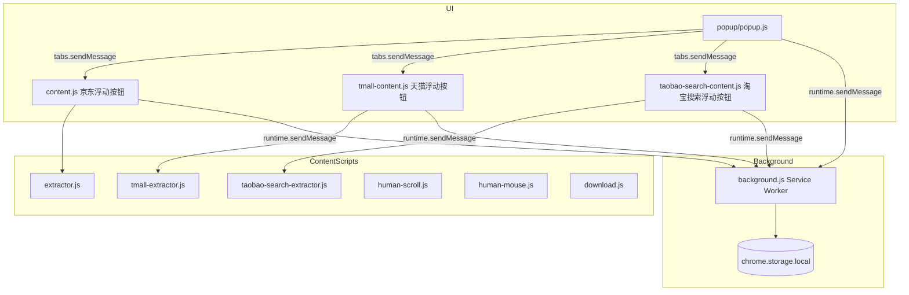

# CN Product Extractor — 开发者文档

面向维护者与二次开发者的技术说明。普通使用说明见 [用户指南](./用户指南.md)。

**当前版本**：2.0.0（`manifest.json`）

---

## 目录

- [项目概述](#项目概述)
- [架构](#架构)
- [目录结构](#目录结构)
- [运行与调试](#运行与调试)
- [核心模块](#核心模块)
- [消息协议](#消息协议)
- [本地存储](#本地存储)
- [数据模型 ProductSource](#数据模型-productsource)
- [页面适配要点](#页面适配要点)
- [导出与导入（不包含定价/上传）](#导出与导入不包含定价上传)
- [扩展与修改指南](#扩展与修改指南)
- [离线测试](#离线测试)
- [权限清单](#权限清单)

---

## 项目概述

Chrome Extension **Manifest V3**，在京东/天猫商品详情页与淘宝搜索列表页注入 content scripts，解析 DOM，输出与 **product-validator** 中 `ProductSource` / `StandardProduct` 规则对齐的 JSON 对象，以 **JSONL**（NDJSON）形式缓存或下载。

设计要点：

- **无构建步骤**：源码即扩展，直接「加载已解压的扩展程序」。
- **人类行为模拟**：`human-scroll.js`（贝塞尔滚屏）、`human-mouse.js`（轨迹点击）降低懒加载漏字段。
- **双通道 UI**：`popup/` 与页面浮动面板均可触发同一套提取逻辑。
- **手动提取**：不提供自动翻页抓取；详情缓存上限 10000 条，超出自动删除最旧。
- **导出**：提取默认只写入缓存，不自动下载；「统一下载全部 JSONL」把缓存导出为单个 JSONL 文件，供 everymarket 后台（`/dashboard/cn_product_imports`）手动导入。

---

## 架构


```mermaid
flowchart TB
  subgraph UI
    Popup[popup/popup.js]
    JdItem[content.js 京东浮动按钮]
    TmallItem[tmall-content.js 天猫浮动按钮]
    TbSearch[taobao-search-content.js 淘宝搜索浮动按钮]
  end

  subgraph ContentScripts
    JdExt[extractor.js]
    TmallExt[tmall-extractor.js]
    TbSearchExt[taobao-search-extractor.js]
    HumanScroll[human-scroll.js]
    HumanMouse[human-mouse.js]
    Download[download.js]
  end

  subgraph Background
    SW[background.js Service Worker]
    Storage[(chrome.storage.local)]
  end

  Popup -->|tabs.sendMessage| JdItem
  Popup -->|tabs.sendMessage| TmallItem
  Popup -->|tabs.sendMessage| TbSearch
  JdItem --> JdExt
  TmallItem --> TmallExt
  TbSearch --> TbSearchExt

  JdItem -->|runtime.sendMessage| SW
  TmallItem -->|runtime.sendMessage| SW
  TbSearch -->|runtime.sendMessage| SW
  Popup -->|runtime.sendMessage| SW
  SW --> Storage
```

### 页面类型与脚本加载

| URL 模式 | 平台判定 | 自动注入（manifest content_scripts） |
|----------|----------|-------------------------------------|
| `detail.tmall.com/item.htm*` | taobao | jd-page-url, tmall-extractor, download, tmall-content |
| `item.jd.com/*.html*` 等 | jd | jd-page-url, jd-scroll-pause, human-scroll, extractor, download, content |
| `s.taobao.com/search*` | taobao（list） | jd-page-url, taobao-risk, jd-scroll-pause, human-scroll, human-mouse, taobao-search-extractor, download, taobao-search-content |

`popup.js` 在 `sendMessage` 失败时会按平台调用 `chrome.scripting.executeScript` 补注入（`injectItemScripts(tabId, platform)` / `injectSearchScripts(tabId)`）。

---

## 目录结构

```
jd-product-extractor/
├── manifest.json           # MV3 清单、权限、content_scripts 匹配
├── background.js           # 详情缓存（去重 + 10000 条上限）、旧 key 迁移
├── popup/
│   ├── popup.html          # 弹窗结构
│   ├── popup.js            # 模式切换、平台分发、消息编排
│   └── popup.css
├── src/
│   ├── extractor.js        # JdProductExtractor — 京东详情页 → ProductSource
│   ├── tmall-extractor.js  # TmallProductExtractor — 天猫详情页 → ProductSource
│   ├── taobao-search-extractor.js # TaobaoSearchExtractor — 搜索列表解析
│   ├── content.js          # 京东详情页 UI + EXTRACT_JD_PRODUCT_WITH_SCROLL
│   ├── tmall-content.js    # 天猫详情页 UI + EXTRACT_TMALL_PRODUCT
│   ├── taobao-search-content.js # 淘宝搜索页 UI + EXTRACT_TAOBAO_SEARCH_LIST
│   ├── jd-page-url.js      # JdPageUrl — 页面类型/平台识别（popup 共用）
│   ├── human-scroll.js     # JdHumanScroll.scrollPageToBottom
│   ├── human-mouse.js      # JdHumanMouse.humanClick
│   ├── taobao-risk.js      # 淘宝搜索页登录/验证检测
│   ├── jd-scroll-pause.js  # 滚屏暂停扩展点
│   └── download.js         # JdJsonlDownload.downloadRecords
├── scripts/
│   ├── test_saved_page.mjs         # Node + linkedom 测京东详情解析
│   ├── test_tmall_saved_page.mjs   # 测天猫详情解析（输出 tmall_product.json）
│   ├── test_taobao_search_page.mjs # 测淘宝搜索列表解析
│   ├── validate_sample.py          # StandardProduct 校验（可传 JSON 路径）
│   └── sample_product.json         # 校验默认样本
├── icons/
└── docs/
    ├── 用户指南.md
    └── 开发者文档.md
```

---

## 运行与调试

### 加载扩展

1. `chrome://extensions` → 开发者模式 → 加载已解压 → 选仓库根目录。
2. 修改任意 JS 后点击扩展 **重新加载**，并 **刷新** 目标页面。

### 调试入口

| 组件 | 打开方式 |
|------|----------|
| Service Worker | 扩展卡片 → 「Service Worker」链接 → DevTools |
| Content script | 页面 F12 → Sources → Content scripts |
| Popup | 右键扩展图标 → 检查弹出内容 |

### 常用断点位置

- `extractor.js` → `extractJdProduct` / `resolveProduct`
- `tmall-extractor.js` → `extractTmallProduct` / `skuGroups`
- `background.js` → `appendProduct`

---

## 核心模块

### extractor.js（京东详情页）

- `extractJdProduct(options)` → ProductSource 形状 payload（含 `_validation_errors`）。
- 数据源：DOM（新老两套京东页面结构）+ `pageConfig` + `club.jd.com` 评价摘要 API。
- 图文详情：`hasPageDescriptionLoaded()` 要求 DOM 中存在 ≥20 字符的详情区，否则弹「请先滚动加载图文详情」。

### tmall-extractor.js（天猫详情页）

- `extractTmallProduct()` → ProductSource 形状 payload。
- 目标结构：tbpc SSR 布局。所有选择器用 `[class*="xx--"]` 前缀匹配（类名带哈希后缀）。
- 关键字段：
  - 标题 `.mainTitle--*`；价格 `[class*="highlightPrice--"]`
  - 图集 `#mainPicImageEl` + `#picGalleryEle img`
  - SKU 变体 `#skuOptionsArea .skuItem--*`（label + `valueItem--*` 值列表，笛卡尔积生成 variants）
  - 参数 `.paramsWrap--*`（emphasis + general 两类行）
  - 图文详情 `#imageTextInfo-content`（净化：去 `descV8-charity`/`<a>`/data 占位/多余属性）
  - 图片取 `src` → `data-savepage-currentsrc` → `data-savepage-src`（兼容保存为 data: URL 的网页）

### taobao-search-extractor.js（淘宝搜索列表）

- `extractTaobaoSearchProducts(options)` / `extractTaobaoSearchProductsMultiPage(options)` → 列表级 ProductSource。
- 卡片与链接/价格/销量/店铺识别见 `findSearchCards` / `parseSearchCard`。

---

## 消息协议

### Content scripts → 页面（tabs.sendMessage）

| 消息 | 发送方 | 接收方 | 响应 |
|------|--------|--------|------|
| `EXTRACT_JD_PRODUCT_WITH_SCROLL` | popup | content.js | `{ ok, data, saved, validation_errors }` |
| `EXTRACT_TMALL_PRODUCT` | popup | tmall-content.js | 同上 |
| `EXTRACT_TAOBAO_SEARCH_LIST` | popup | taobao-search-content.js | `{ ok, data }`（data.products） |

### Content scripts / popup → background（runtime.sendMessage）

| 消息 | 说明 | 响应 |
|------|------|------|
| `APPEND_JSONL_RECORD` / `APPEND_AND_DOWNLOAD_JSONL` | 追加一条 product（去重 + 10000 条上限） | `{ ok, count, records, filename, maxRecords }` |
| `APPEND_JSONL_RECORDS` | 批量追加 products（淘宝列表整批写入，避免逐条读写 storage） | 同上 |
| `GET_JSONL_RECORDS` / `DOWNLOAD_JSONL` | 读取全部详情记录 | 同上 |
| `CLEAR_JSONL_RECORDS` | 清空详情缓存 | `{ ok }` |

---

## 本地存储

| key | 内容 | 说明 |
|-----|------|------|
| `cn_jsonl_records` | `ProductSource[]` | 详情缓存，最多 10000 条，超出删除最旧；导出 `cn-details-*.jsonl`（「统一下载全部 JSONL」） |

旧版 key（`jd_jsonl_records`、`jd_crawl_*`、`jd_product_url_queue`）在后台启动时自动迁移/清理。

---

## 数据模型 ProductSource

与 `em_product.ProductSource`（product-validator 仓库）对齐的字段集；下载的每行 JSON 可直接被 `StandardProduct` / `ProductSource` 校验：

```bash
python3 scripts/validate_sample.py scripts/tmall_product.json
```

关键约束（镜像自 em_product）：

- `description` 不能为空、不能含 `<a>` 标签
- `images` 以 `;` 分隔且每条以 `http` 开头
- `categories` 以 `>` 分隔且各段不重复
- `specifications` 每项只能有 `name` / `value`
- `variants[].sku` / `variants[].price` 必填

---

## 页面适配要点

- 天猫/淘宝类名带哈希后缀（如 `mainTitle--R75fTcZL`），一律用 `[class*="~--"]` 前缀匹配，避免硬编码完整类名；布局小改动一般不受影响。
- 保存网页（Save Page）会把图片本地化为 `data:` URL，真实地址在 `data-savepage-src` / `data-savepage-currentsrc` 属性；`imageSource()` 在处理两者。
- 京东图文详情懒加载，须先滚动；天猫 SSR 直接渲染，无需滚屏。

---

## 导出与导入（不包含定价/上传）

扩展不做价格计算与上传：提取默认只写入详情缓存，由「统一下载全部 JSONL」导出为单个 `cn-details-*.jsonl` 文件（每行一条 ProductSource）。定价与商品导入在 everymarket 后台完成（`/dashboard/cn_product_imports` 接受该 JSONL 文件）。

---

## 扩展与修改指南

接到「某字段没抓到」类问题时，按顺序排查：

1. 目标页面是否有该数据（F12 → Elements）。
2. `tryBuildProductFromDom` / `parseSpecificationsFromDom` 等相关解析函数选择器是否命中。
3. 保存整页 HTML 后用 `npm run test:tmall-saved -- <file>`（或 `test:saved`）离线回归。
4. 输出文件用 `python3 scripts/validate_sample.py <json>` 校验 StandardProduct。

---

## 离线测试

```bash
npm install
npm run test:saved -- /path/to/saved-jd-item.html
npm run test:tmall-saved -- /path/to/saved-tmall-item.html
npm run test:taobao-search -- /path/to/saved-tb-search.html
```

原理：linkedom 解析 HTML → vm 注入 extractor → 与 content script 相同入口调用解析函数。

---

## 权限清单

`host_permissions` 覆盖：京东商品域（item.*.jd.com 等）、`api.m.jd.com`、`club.jd.com`（评价摘要）、`*360buyimg.com`、`vod.jd.com`、淘宝/天猫域、`*.alicdn.com`（图片）。